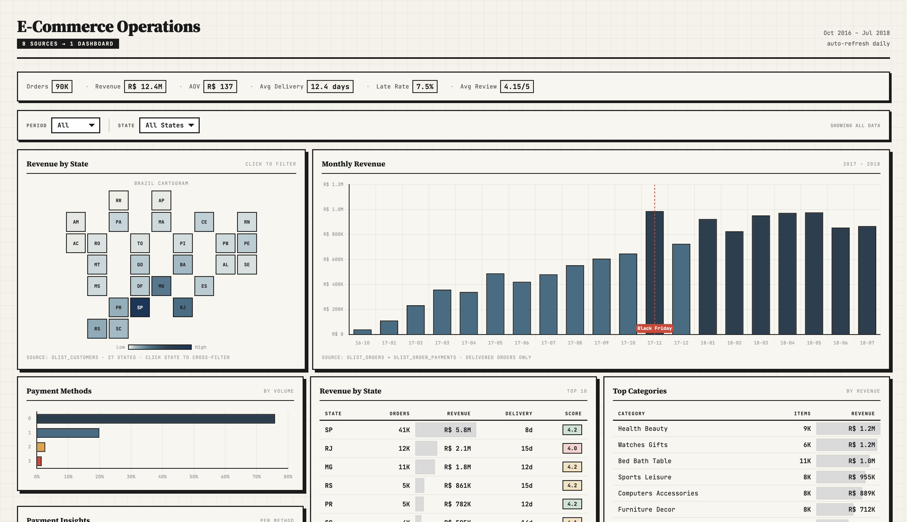

# E-Commerce Operations Dashboard

8 disconnected data sources → one interactive dashboard with cross-filtering.

**[Live Demo](https://gonzalles2009.github.io/ecommerce-ops-pipeline/)** — open in browser, click states on the map, switch periods.



## The Problem

An e-commerce marketplace generating 96,000+ orders across 27 Brazilian states. Order data, payment records, customer profiles, product catalogs, seller info, delivery tracking, reviews, and geolocation — each in its own CSV export, none connected.

Typical questions that required manual work across multiple files:
- "Which states have the highest late delivery rates?"
- "Do credit card buyers spend more than boleto buyers?"
- "Where did revenue grow fastest last quarter?"

## Key Findings

Before the technical details — here's what the dashboard revealed:

- **SP** (Sao Paulo) drives 42% of revenue and has the fastest delivery (8.5 days vs 12.4 national average)
- **Credit card** buyers spend 14% more per order (R$166 vs R$145 for boleto) and split across 3.5 installments
- **Black Friday 2017** hit R$988K peak revenue — but late deliveries spiked to 11.3%, breaching the 10% SLA
- **Delivery estimates** started at ~2x actual (safety buffer), then tightened as operations matured
- **Review scores track delivery speed**: states with sub-10-day delivery consistently score above 4.2/5

## What I Built

**ETL pipeline** (Python + DuckDB):
- Extracts 8 raw datasets (1.4M rows total)
- Deduplicates geolocation (1,000,163 → 19,015 unique zip codes)
- Builds a star schema: 4 dimension tables + 2 fact tables
- Creates 8 analytical SQL views
- Full run: **1.5 seconds**

**Interactive dashboard** (single HTML file, no server needed):
- **Cross-filtering** — select a state on the map, every chart and table updates
- **Period filter** — slice all data by half-year
- **Brazil cartogram** — 27 clickable states, colored by revenue
- **Revenue heatmap** (State x Month) — growth patterns across geography and time
- **Activity heatmap** (Day x Hour) — peak ordering windows
- **Annotated charts** — Black Friday marker, 10% SLA threshold line
- **Data provenance** — source notes on every visualization

**[Open dashboard.html](dashboard.html)** to explore interactively.

## Architecture

```
Raw CSVs (8 files, 1.4M rows)
    │
    ▼
[Extract] — read CSVs, parse dates, coerce types
    │
    ▼
[Transform] — normalize cities, deduplicate geo, build star schema
    │
    ▼
[Load] — DuckDB warehouse (366K rows across 6 tables)
    │
    ▼
[SQL Views] — 8 analytical views (monthly revenue, state performance, delivery SLA...)
    │
    ▼
[Dashboard] — Chart.js + vanilla JS, data embedded as JSON, cross-filtering in browser
```

## Data Model

| Table | Rows | Purpose |
|-------|------|---------|
| `dim_products` | 32,951 | 74 product categories, physical dimensions |
| `dim_customers` | 99,441 | Customer locations across 27 states |
| `dim_sellers` | 3,095 | Seller locations and IDs |
| `dim_geography` | 19,015 | Zip code → lat/lng lookup (deduplicated from 1M rows) |
| `fact_orders` | 99,441 | Revenue, delivery time, review score, payment method per order |
| `order_items_detail` | 112,650 | Product, seller, and price per line item |

## How to Run

Requires [uv](https://docs.astral.sh/uv/) (Python package manager) and a free [Kaggle API token](https://www.kaggle.com/settings).

```bash
git clone <repo-url>
cd ecommerce-ops
uv sync

export KAGGLE_API_TOKEN=<your-token>
uv run kaggle datasets download olistbr/brazilian-ecommerce -p data/raw --unzip
uv run python -m src.pipeline

open dashboard.html
```

Pipeline output:
```
[1/3] Extracting raw data... 9 tables
[2/3] Transforming... 6 output tables, 74 categories, 27 states
[3/3] Loading into DuckDB warehouse... 366,593 rows
Done. 1.5s
```

## Project Structure

```
ecommerce-ops/
├── src/
│   ├── extract.py       # Read raw CSVs, parse dates
│   ├── transform.py     # Normalize, deduplicate, star schema
│   ├── load.py          # Write to DuckDB
│   └── pipeline.py      # Orchestrate Extract → Transform → Load
├── models/
│   └── views.sql        # 8 analytical SQL views
├── docs/                # Screenshots
├── dashboard.html       # Interactive dashboard (standalone, no server)
├── pyproject.toml       # Dependencies
└── .gitignore           # Excludes raw data and warehouse file
```

## Stack

| Layer | Tool | Why |
|-------|------|-----|
| ETL | Python | Flexible, handles any data source |
| Warehouse | DuckDB | Columnar OLAP, zero setup, same SQL as BigQuery |
| Visualization | Chart.js | Lightweight, no server, embeds in single HTML |
| Interactivity | Vanilla JS | Cross-filtering, heatmaps, map — no framework needed |

No SaaS dependencies. No API keys for the dashboard. One command to build, one file to open.

## Dataset

[Brazilian E-Commerce by Olist](https://www.kaggle.com/datasets/olistbr/brazilian-ecommerce) — 100K orders from a Brazilian marketplace, 2016-2018. Public dataset, CC-BY-NC-SA-4.0.

---

Built by [Aleksandr K.](https://www.upwork.com/freelancers/~0195e664540678493b)
